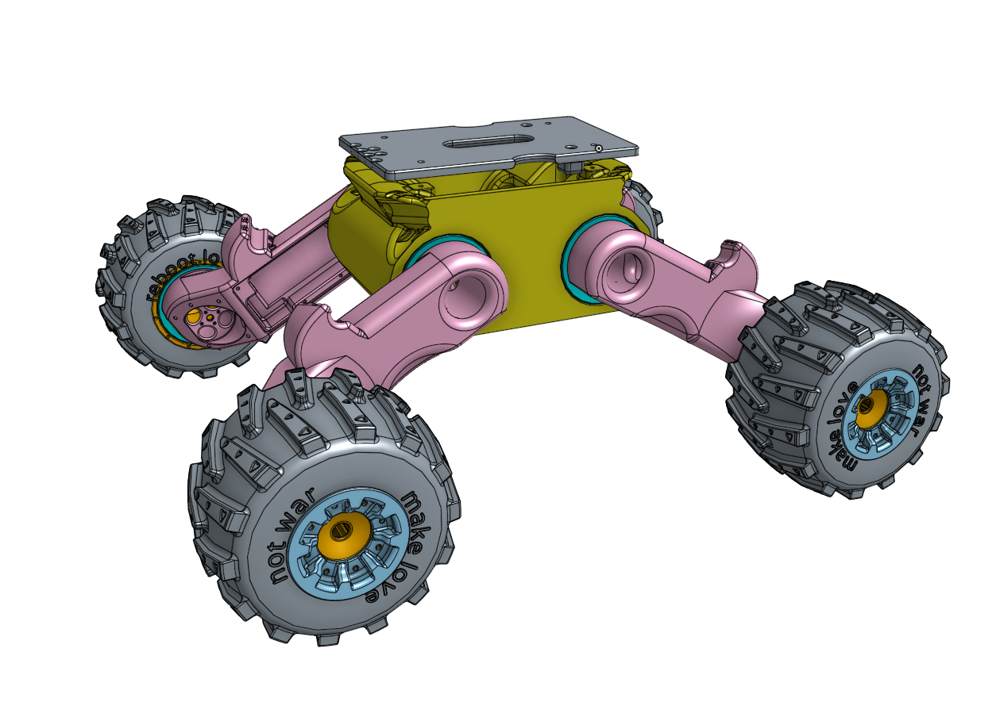
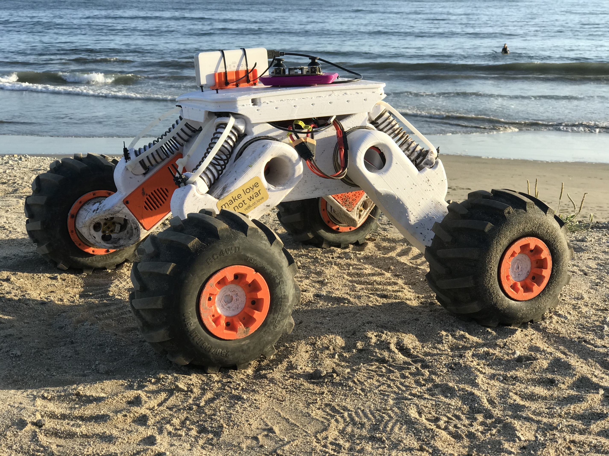
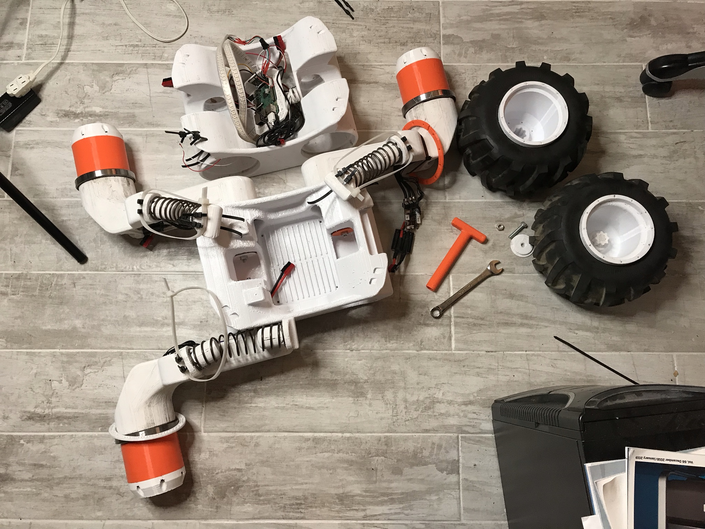

# rover_designs

Printable STL files for [Rover, the off road explorer robot](https://reboot.love/t/new-cameras-on-rover/277/).

You will likely want to edit the files. To do so create a free OnShape
account by visiting the following link:
(https://www.onshape.com/en/products/free](https://www.onshape.com/en/products/free)

And then open the [Rover OnShape design files](https://cad.onshape.com/documents/456d1f84fb77a5beb824aec7/w/15d52f59f17284e440ab75b8/e/83f27dd468c03acabf5965a8), duplicate the design in to your
account, and edit away!

